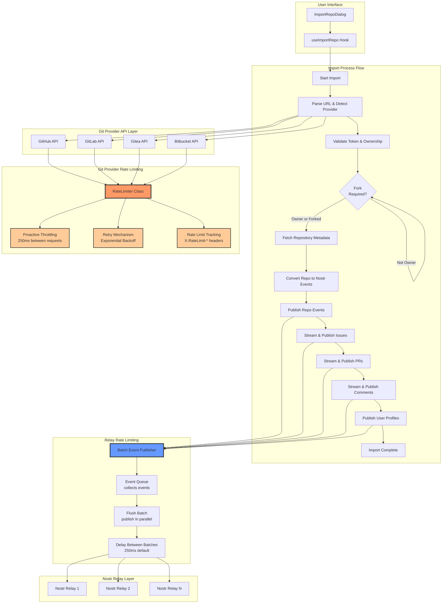
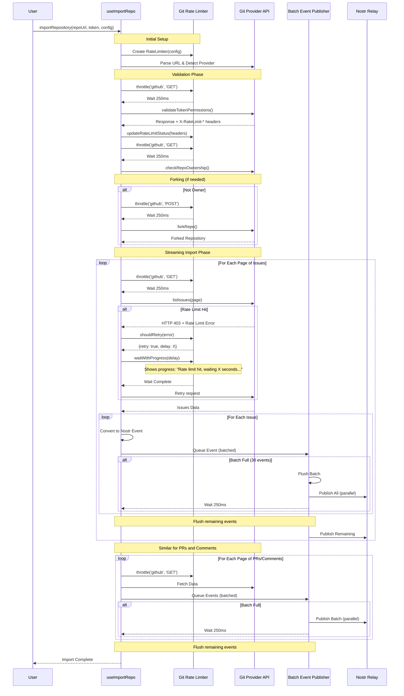
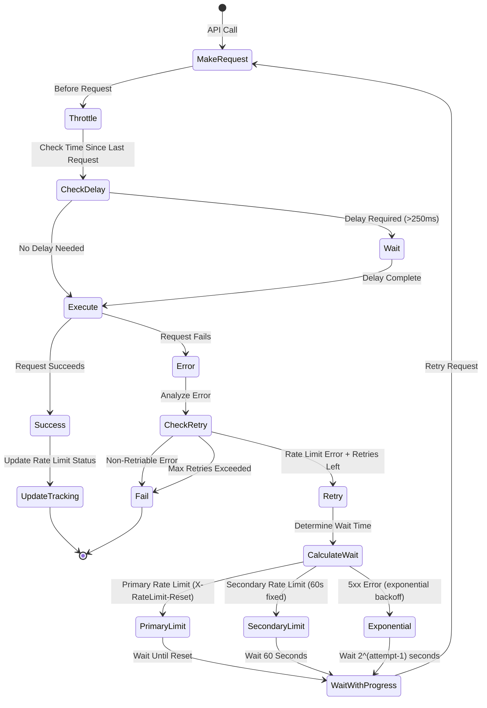

# Import Repository Feature Architecture

## Overview

This document describes the architecture and rate limiting strategies for the repository import feature, which imports repositories from Git hosting providers (GitHub, GitLab, Gitea, Bitbucket) into the Nostr Git system.

## Architecture Diagram



## Rate Limiting Strategies

### Git Provider Rate Limiting (Three-Layer Approach)

The system implements a three-layer rate limiting strategy for Git provider APIs:

#### Layer 1: Proactive Request Throttling

- **Purpose**: Prevent hitting rate limits in the first place
- **Implementation**: Minimum 250ms delay between requests (configurable via `secondsBetweenRequests`)
- **Measurement**: Delay measured from end of previous request, not start
- **Location**: `RateLimiter.throttle()` method

```typescript
// Example: Always wait at least 250ms between GitHub API requests
await rateLimiter.throttle("github", "GET")
const data = await api.listIssues(owner, repo)
```

#### Layer 2: Retry Mechanism with Backoff

- **Purpose**: Handle rate limit errors gracefully
- **Error Detection**:
  - HTTP 403 status code
  - Response body containing "rate limit exceeded"
  - Response headers: `Retry-After`, `X-RateLimit-Reset`
- **Retry Strategy**:
  - **Primary Rate Limit**: Uses `X-RateLimit-Reset` header to calculate exact wait time
  - **Secondary Rate Limit** (abuse detection): Fixed 60-second wait (configurable via `secondaryRateWait`)
  - **5xx Server Errors**: Exponential backoff (1s, 2s, 4s, ...)
  - **Max Retries**: 3 attempts (configurable via `maxRetries`)
- **Location**: `RateLimiter.shouldRetry()` method

#### Layer 3: Rate Limit Status Tracking

- **Purpose**: Monitor remaining quota to inform users
- **Tracking**: Extracts and stores `X-RateLimit-*` headers:
  - `X-RateLimit-Remaining`: Requests left in window
  - `X-RateLimit-Limit`: Total requests allowed
  - `X-RateLimit-Reset`: Unix timestamp when limit resets
- **Usage**: Provides visibility into quota status
- **Location**: `RateLimiter.updateRateLimitStatus()` method

### Relay Rate Limiting (Batched Publishing)

For Nostr relays, a batched publishing approach is used to optimize performance:

#### Batched Event Publishing

- **Purpose**: Publish multiple events efficiently while respecting relay rate limits
- **Implementation**:
  - Events are collected into batches (default: 30 events per batch)
  - Events in each batch are published in parallel using `Promise.allSettled()`
  - A delay is applied between batches (default: 250ms)
- **Performance**: ~20x faster than per-event delays (e.g., 1000 events: ~8.5 seconds vs ~200 seconds)
- **Configuration**:
  - `relayBatchSize` in `ImportConfig` (default: 30 events)
  - `relayBatchDelay` in `ImportConfig` (default: 250ms)
- **Location**: `publishEventBatched()` and `flushEventQueue()` functions

```typescript
// Example: Collect events into batches
await publishEventBatched(context, signedEvent)
// When batch reaches size (30), events are published in parallel
// Then wait 250ms before next batch
```

#### Batch Flushing

- Batches are automatically flushed when they reach the configured size
- Remaining events in the queue are flushed at the end of each phase (issues, PRs, comments, profiles)
- Final flush ensures all queued events are published before import completes

#### No Retry Mechanism

- Relays typically don't have the same aggressive rate limiting as Git providers
- Event publication failures are handled at a higher level (not retried automatically)

## Detailed Flow with Rate Limiting



## Rate Limit Error Handling



## Configuration

### Rate Limiter Configuration

```typescript
interface RateLimitConfig {
  secondsBetweenRequests?: number // Default: 0.25 (250ms)
  secondaryRateWait?: number // Default: 60 (seconds)
  maxRetries?: number // Default: 3
}
```

### Import Configuration

```typescript
interface ImportConfig {
  relayBatchSize?: number // Default: 30 (events per batch)
  relayBatchDelay?: number // Default: 250 (milliseconds between batches)
  // ... other options
}
```

## Provider-Specific Rate Limits

### GitHub

- **Authenticated**: 5,000 requests/hour
- **Headers**: `X-RateLimit-Limit`, `X-RateLimit-Remaining`, `X-RateLimit-Reset`
- **Secondary Limits**: Abuse detection triggers 60s wait

### GitLab

- **Authenticated**: 2,000 requests/minute
- **Headers**: Similar to GitHub
- **Note**: May have different header names

### Gitea

- **Rate Limits**: Configurable per instance
- **Headers**: May vary by instance

### Bitbucket

- **Rate Limits**: Varies by plan
- **Headers**: May differ from GitHub

## Progress Tracking

The import system uses step-based progress tracking instead of percentage-based progress:

- **Step Messages**: Clear messages describing current operation (e.g., "Publishing issues...")
- **Count Information**: Actual counts of published items (e.g., "150 published", "3/10 profiles")
- **No Fake Percentages**: Progress shows real counts, not estimated percentages

### Progress Interface

```typescript
interface ImportProgress {
  step: string // Current step/message
  current?: number // Current count (e.g., published issues)
  total?: number // Total count (e.g., for profiles: 3/10)
  isComplete: boolean // Whether import is complete
  error?: string // Error message if failed
}
```

## Best Practices

1. **Always use rate limiter**: Wrap all Git API calls with `withRateLimit()`
2. **Monitor quota**: Check `getRemainingQuota()` for user feedback
3. **Use batched publishing**: Leverage `relayBatchSize` and `relayBatchDelay` for efficient relay publishing
4. **Stream processing**: Process and publish items incrementally to minimize memory usage
5. **Progress updates**: Use `onProgress` callback to show step messages and counts to users

## Memory Optimization

The import process uses streaming to minimize memory:

- Issues/PRs/Comments are fetched page-by-page (100 per page)
- Each item is immediately converted and published
- Only lightweight ID mappings are kept in memory:
  - `issueEventIdMap`: issue.number → nostr event ID
  - `prEventIdMap`: pr.number → nostr event ID
  - `commentEventMap`: platformCommentId → nostr event ID

This allows importing large repositories without loading everything into memory at once.
